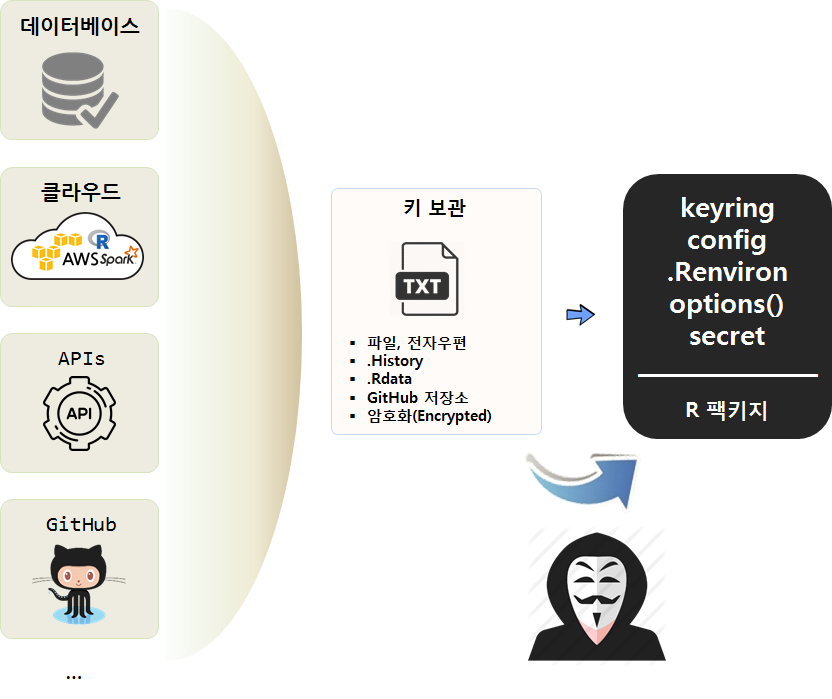

---
# Please do not edit this file directly; it is auto generated.
# Instead, please edit 05-api-programming.md in _episodes_rmd/
title: "API 프로그래밍"
teaching: 180
exercises: 0
questions:
- "API란 무엇인가?"
- "왜 API를 사용할까?"
- "함수, 메쏘드, 팩키지, API를 구분할 수 있는가?"
objectives:
- "API 출현 배경을 이해한다."
- "API의 다양한 형태를 구분한다."
- "API 활용사례를 살펴본다."
keypoints:
- "API, 함수, 메쏘드, 팩키지, 모듈을 구분한다."
- "API 기본기를 습득한다."
- "API를 활용하여 원하는 바를 추구한다."
source: Rmd
---

## API란? [^api-definition] {#api-definition}

[^api-definition]: [네이버 지식백과 API (application programming interface), 두산백과](https://terms.naver.com/entry.nhn?docId=1179553&cid=40942&categoryId=32837)

**API**(Application Programming Interface)는 운영체제와 응용프로그램 사이의 통신에 사용되는 언어나 메시지 형식을 말한다.

운영체제나 C, C++, Pascal 등과 같은 언어로 응용 프로그램을 만들 때, 윈도우를 만들고 파일을 여는 것과 같은 처리를 할 수 있도록 1,000여 개 이상의 함수로 구성되어 있다. 
API는 **프로그래머**를 위한 운영체제나 프로그램의 인터페이스로서 **사용자**와 직접 대하게 되는 그래픽 사용자 인터페이스나 명령형 인터페이스와 뚜렷한 차이가 있다.

API는 응용 프로그램이 운영체제나 데이터베이스 관리 시스템과 같은 시스템 프로그램과 통신할 때 사용되는 언어나 메시지 형식을 가지며, API는 프로그램 내에서 실행을 위해 특정 서브루틴에 연결을 제공하는 함수를 호출하는 것으로 구현된다. 그러므로 하나의 API는 함수의 호출에 의해 요청되는 작업을 수행하기 위해 이미 존재하거나 또는 연결되어야 하는 몇 개의 프로그램 모듈이나 루틴을 가진다. 

**좋은 API**는 모든 building block을 제공함으로써 프로그램 개발을 쉽게 해준다. 
프로그래머는 그 block을 함께 합치기만 하면 된다. 
API가 프로그래머를 위해서 만들어지기는 했지만, 사용자 입장에서도 같은 API를 사용한 프로그램은 비슷한 인터페이스를 가지기 때문에 새로운 프로그램의 사용법을 배우기가 쉬워진다.

## 소프트웨어 이해 {#api-software}

- [컴퓨터 소프트웨어 과외](http://statkclee.github.io/open-source-for-business/ch02-tutorial-on-computer-software.html)

## API 활용 사례 {#api-usage}

- 데이터 API
    - 들어가며 
        - [데이터 과학 – 기초 통계, `tidycensus` 기초](https://statkclee.github.io/statistics/tidycensus-basic.html)
    - 웹크롤링과 API 비교
        - [데이터 과학 – 기초 통계, `kosis`와 `tidycensus` 비교](https://statkclee.github.io/statistics/tidycensus-kosis-comparison.html)
- 함수 API
    - 유료와 무료    
        - [공간통계를 위한 데이터 사이언스, "지리정보 API - 주소와 위도경도"](https://statkclee.github.io/spatial/geo-info-lonlat.html)
    - AI 인공지능
        - [xwMOOC 딥러닝, "텍스트와 이미지 API"](https://statkclee.github.io/deep-learning/ms-text-image.html)
        - [구글 클라우드 비젼 API](https://statkclee.github.io/deep-learning/r-google-vision-api.html)
        - [xwMOOC 딥러닝 - "IBM 왓슨"](https://statkclee.github.io/deep-learning/r-watson.html)
        - [유튜브 - "알릴레요 vs. 홍카콜라 - 댓글 분류"](https://statkclee.github.io/text/nlp-youtube-comment.html)
    

## API와 열쇠관리 {#api-key}

- [데이터 사이언스를 위한 소프트웨어 공학, "API 프로그래밍을 위한 열쇠 관리"](https://statkclee.github.io/sw4ds/sw4ds-api-programming-key.html)

## 예측모형 API 개발 [^parallel-r] {#api-predictive-model}

[^parallel-r]: [R 병렬 프로그래밍](https://statkclee.github.io/parallel-r/)

- [R 양산환경(`plumber`) - 타이타닉](https://statkclee.github.io/parallel-r/r-in-production-plumber.html)    
- [신용위험 확률(plumber) API](https://statkclee.github.io/parallel-r/r-credit-score-api.html)    
- [TV 시청시간 예측서비스 - 데이터는 openCPU, 구현은 plumber, 서비스는 AWS](https://statkclee.github.io/parallel-r/r-gss-tvhours.html)

