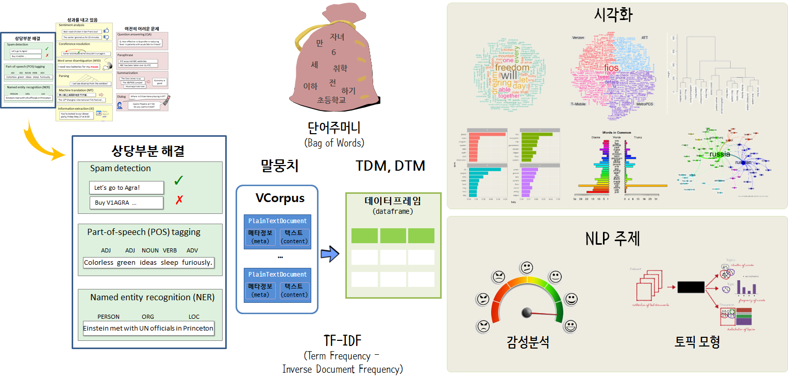

```{r, include=FALSE}
source("../bin/chunk-options.R")
knitr_fig_path("06-")
```

## 텍스트 기초 {#nlp-basic}

- [데이터 과학을 위한 저작도구, "R 유니코드, 인코딩"](https://statkclee.github.io/ds-authoring/regex-encoding.html)

## 자연어 처리 흐름 [^nlp-workflow] {#nlp-basics-workflow}

[^nlp-workflow]: [텍스트 데이터와 자연어 처리 작업흐름](https://statkclee.github.io/text/nlp-text.html)



## 트위터 - `tidytext` + `tidyverse` {#nlp-tidytext}

- [트위터 - tidyverse + tidytext](https://statkclee.github.io/text/nlp-twitter-tidytext.html)


## [R 텍스트 마이닝](https://statkclee.github.io/text/)


